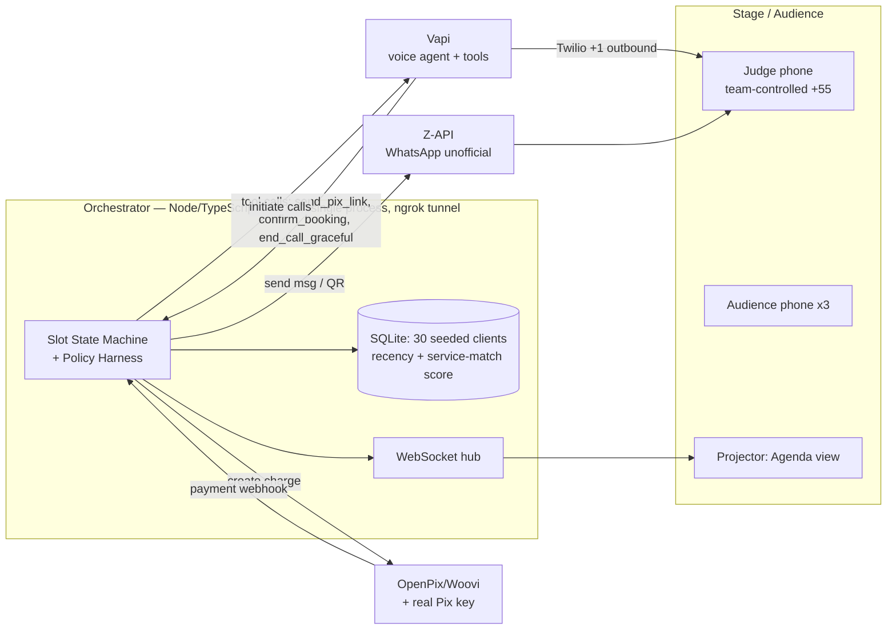

# Agenda Cheia — Hackathon Implementation Plan

**One-day build. São Paulo. Team of 5. Demo: 3 minutes. Goal: a phone rings on stage and money moves.**

---

## 1. Overview & Demo Thesis

**Product.** Agenda Cheia is an outbound AI agent for salons, barbershops, clinics, and pilates/fitness/yoga studios in Brazil (class businesses are a natural fit: last-minute cancellations are constant and the class waitlist is a pre-qualified buyer list — the ranker's waitlist signal does all the work). When a client cancels, the agent immediately works the client list — WhatsApp messages plus live phone calls in natural pt-BR — resells the empty slot at a última-hora discount, and locks the booking with a R$10–20 Pix *sinal* (deposit). The deposit kills no-shows; the outbound motion turns dead calendar time into revenue. Positioning: incumbents (Trinks, Booksy, AppBarber) ship *receptionists* — we ship a **motor de receita**.

**Demo thesis.** Judges do not remember dashboards; they remember their own phone ringing. The centerpiece: a judge's (team-controlled) phone rings live, a warm paulistana voice negotiates the slot, mid-call the agent says *"vou te mandar o Pix do sinal no seu zap"*, the Pix QR arrives on WhatsApp while the call is still live, the judge pays (real R$0,50), the bank notification sound plays into the mic, and the projected agenda slot flips green. Then we multiply the wow: **three parallel calls** to three phones held up in the audience, three Pix confirmation dings, and a live **"R$ recuperado"** counter ticking real money.

**Non-negotiable core loop (never cut):** live call → mid-call Pix on WhatsApp → payment webhook → slot flips green.

---

## 2. Architecture



### Slot state machine (the policy harness core)

```
open ──start_campaign──▶ offering(3)          # WhatsApp blast + up to 3 outbound calls; OFFER WINDOW starts (15 min)
offering ──client_engages──▶ negotiating       # per-client sub-state; discount ladder applies
negotiating ──send_pix_link──▶ awaiting_pix    # charge created, QR sent, 10-min PIX TTL
awaiting_pix ──webhook:paid──▶ locked          # FIRST PAYER WINS (atomic check-and-set)
awaiting_pix ──ttl_expired──▶ offering         # slot re-opens to remaining candidates
offering ──offer_window_expired──▶ open        # nobody bit in 15 min → next batch of candidates (or owner notified)
any losing client ──▶ graceful_exit            # "Poxa, esse horário já foi preenchido! Te aviso na próxima 😉"
```

**Double-timer scarcity mechanic (this is what makes the urgency real, not rhetorical):** two independent timers per campaign. (1) The **offer window** — the WhatsApp/call offer is explicitly time-boxed: *"tenho um horário às 14h com 20% off — válido pelos próximos 15 minutos"*; when it expires, the batch closes and the next-ranked candidates get a fresh offer. (2) The **Pix QR TTL** (~10 min) — once a client accepts, the charge itself expires; the QR dying is the enforcement of "reserva de verdade é sinal pago." The agent states both deadlines out loud; code enforces both.

Rules enforced **in code, not in the prompt**:
- **First-payer-wins:** the webhook handler does an atomic `UPDATE slots SET state='locked' WHERE id=? AND state != 'locked'`; second webhook gets the graceful-loser path. Losers on a live call get the agent redirected to the graceful line; losers on WhatsApp get the message above.
- **Price floor:** every `send_pix_link(price)` from the LLM is validated against the owner-set floor and the discount ladder. Out-of-policy → tool returns an error string the agent must relay ("não consigo fazer esse valor"). **The LLM proposes; code enforces.**
- Every agent tool call is logged and rendered on the agenda view's event ticker (great for judges' technical questions).

### Components
- **Orchestrator** — Node 20 + TypeScript + Fastify, one process, in-memory state mirrored to SQLite (Drizzle or raw `better-sqlite3`). Exposes: Vapi tool-call webhook, Z-API inbound webhook, Pix payment webhook, `/demo/*` operator endpoints (start campaign, simulate payment, reset).
- **Voice layer** — Vapi (primary) with Twilio outbound (+1 caller ID, geo-permission for BR dialing). Retell configured as hot spare with the same prompt.
- **WhatsApp layer** — Z-API on 3 warmed numbers (round-robin failover baked into the client wrapper). Twilio WhatsApp Sandbox as hot spare (judge phone pre-joined via `join <code>`).
- **Payments** — OpenPix/Woovi for QR + webhook; a **real R$0,50 Pix** to a team member's bank key for the authentic notification sound. `/demo/simulate-payment` button always armed.
- **Agenda view** — thin read-only React (Vite) grid of the day, one salon, websocket-driven: red (cancelled) → pulsing yellow (offering/negotiating) → green (locked, shows client name + "sinal R$15 pago ✔"), plus the "R$ recuperado hoje" counter and event ticker.
- **Seeded CRM** — 30 fake clients in SQLite: name, phone, last service, last visit date, preferred barber, **booking-lead-time history** (how far in advance they typically book), waitlist flag, next-appointment date, no-show count. Ranking = plain scoring, no ML:

  ```
  score = 2×service_match
        + 2×last_minute_propensity      # avg booking lead time < 24h → these clients SAY YES to última-hora offers
        + 3×on_waitlist_for_earlier     # asked for an earlier slot = strongest signal that exists
        + recency_decay(last_visit)
        + 1×prefers_this_professional
  HARD EXCLUDES (never contacted):
    - has own appointment within next 7 days   # offer would cannibalize existing revenue
    - no_show_count ≥ 2                        # defeats the purpose of the sinal
    - opted out / "não perturbe" flag          # LGPD hygiene
  ```

  Top-N gets the campaign. Demo clients (judge + audience phones) seeded with max scores so they're always picked. In the pitch, name the propensity signal explicitly — "a gente oferece pra quem historicamente marca em cima da hora" is a one-liner judges remember.
- **Cancellation ingestion (production story; faked on demo day)** — three sources, in order of Brazilian reality: (1) the client texts "não vou poder ir" on the salon's WhatsApp — the agent itself detects the intent, confirms politely, and releases the slot (no integration needed; this is the most common path and the demo's chosen one); (2) webhook/API from the incumbent agenda (Trinks, Booksy, AppBarber) or Google Calendar for the informal ones; (3) manual owner tap. Position as **integration-first across all schedulers** — "conecta na agenda que você já usa" — which is also the strategic answer to "won't Trinks ship this": Agenda Cheia sits above every scheduler instead of being a feature inside one. On demo day, source (1) is live (a "client" texts the cancellation and the agent handles it end-to-end) and sources (2)–(3) are one slide.

---

## 3. Tech Stack

| Layer | Primary (build this) | Fallback (pre-configured, one switch away) |
|---|---|---|
| Voice agent platform | **Vapi** (fast tool-calls, good latency dashboard) | Retell, same prompt imported night-before |
| LLM (voice brain) | **GPT-4o via Vapi** (lowest tested latency) | Claude Haiku-class via Vapi model dropdown |
| TTS voice (pt-BR) | **ElevenLabs Flash v2.5**, warm female paulistana — *pick by ear in night-before bake-off* | Cartesia Sonic pt-BR |
| STT | Deepgram Nova-2 pt-BR (Vapi default) | Vapi alternative STT toggle |
| Telephony | **Twilio via Vapi**, +1 number, BR geo-permissions enabled night-before | Retell's bundled telephony |
| WhatsApp | **Z-API**, 3 warmed numbers, wrapper with auto-failover | Twilio WhatsApp Sandbox (pre-joined) |
| Pix | **OpenPix/Woovi** (instant sandbox, clean webhook) + real R$0,50 to team key for the sound | Asaas sandbox; `/demo/simulate-payment` button |
| Backend | **Node 20 + TypeScript + Fastify**, single repo, pnpm | — (no fallback; this is the spine) |
| DB | **SQLite** (`better-sqlite3`) | In-memory objects + JSON dump |
| Realtime | **ws** (plain WebSocket) | 2-second polling |
| Frontend | **React + Vite + Tailwind**, read-only | Static HTML + polling |
| Tunnel | **ngrok** (paid, reserved domain — stable webhook URLs) | Cloudflare Tunnel |
| Demo network | **4G hotspot** (dedicated phone, tested at venue) | Second hotspot on a different carrier |
| Deploy | Laptop + ngrok (restartable in 5 s) | Railway/Fly instance as cold spare |

---

## 4. Night-Before Checklist (everything provisionable, provisioned)

Do this the evening before, at the venue if possible. Owner in [brackets].

- [ ] **Z-API ×3** [Full-stack A]: register 3 accounts on 3 real chips/numbers; scan QRs; **warm each number** — 20+ organic two-way messages with team/friends over the evening; verify media (QR image) sending; store all 3 tokens in `.env`; test wrapper failover by killing number 1.
- [ ] **Twilio geo-permissions** [Full-stack B]: enable Brazil (+55) outbound voice on the Twilio account behind Vapi *and* the Retell spare; place one real test call to a +55 mobile; confirm caller ID shows +1 (we disclose this on stage — BR numbers need a regulatory bundle, days of lead time, not provisionable day-of).
- [ ] **Voice bake-off** [AI eng A]: same 4 test sentences through ElevenLabs Flash v2.5 vs Cartesia Sonic on Vapi *and* Retell; measure end-to-end turn latency on the 4G hotspot; **pick one, write it down, stop tweaking**. Target: sub-second perceived turnaround.
- [ ] **Pix** [Full-stack B]: OpenPix/Woovi account + API key + webhook pointed at reserved ngrok domain; one full sandbox charge→webhook round trip; register real Pix key of a team member; do one **real R$0,50** end-to-end (QR on WhatsApp → pay → bank *ding* → webhook via provider or manual confirm); arm `/demo/simulate-payment`.
- [ ] **4G hotspot** [Mobile/floater]: test full call flow on hotspot; measure latency; charge power banks; buy second chip on a different carrier.
- [ ] **Backup video** [Mobile/floater]: record a clean full run of the core loop on phone + screen capture; load it on the presenting laptop AND a phone.
- [ ] **Stage phones** [Mobile/floater]: 4 phones (1 judge-held, 3 audience), all with WhatsApp active, ringtones at max, DND off, numbers seeded in the CRM.
- [ ] **Twilio WA Sandbox spare** [Full-stack A]: all 4 phones send `join <code>`; rehearse the opt-in once so it's muscle memory.
- [ ] Reserved ngrok domain up; `.env.example` complete; repo boots on both laptops.

---

## 5. Hour-by-Hour Build Schedule (12h, 08:00–20:00)

**Workstreams.** AI-1 & AI-2 (voice agent, persona, policy harness, latency) · FS-1 (orchestrator, state machine, Pix) · FS-2 (WhatsApp, agenda view, websocket) · MOB (stage phones, client-side UX, rehearsal director, floater).

| Hour | AI-1 (agent) | AI-2 (policy/latency) | FS-1 (core/Pix) | FS-2 (WA/UI) | MOB (demo ops) |
|---|---|---|---|---|---|
| 08–09 | Vapi assistant skeleton, chosen voice, first live call | Define tool schemas (`send_pix_link`, `confirm_booking`, `end_call_graceful`) | Repo, Fastify, SQLite schema, seed 30 clients | Z-API wrapper + failover; first outbound message | Phones setup; venue audio/HDMI recon |
| 09–10 | System prompt v1 (pt-BR, §7); persona test calls | Policy harness: floor + ladder validation on every tool call | Slot state machine + transitions + event log | Agenda grid React app, websocket hub | Demo script doc; scores demo clients max |
| 10–11 | Tool-call wiring: agent → orchestrator webhooks | Off-topic rails + "assistente virtual" self-ID tested adversarially | OpenPix charge creation + payment webhook → `locked` | QR image delivery via Z-API into a chat | **Checkpoint: single call end-to-end attempt** |
| 11–12 | **CORE LOOP MILESTONE:** live call → mid-call `send_pix_link` → QR on WhatsApp → pay → slot flips green. All hands until this works. | | | | |
| 12–13 | Latency tuning (filler phrases, streaming, endpointing) | First-payer-wins race test (2 concurrent payers) | Campaign engine: rank CRM, fire WA blast + N calls | Counter + event ticker on agenda view | Lunch runs; rehearse judge handoff |
| 13–14 | Negotiation quality: objections ("tá caro", "não posso hoje") | Loser paths: graceful WA message + live-call redirect | TTL expiry → reopen slot | Slot animations (yellow pulse → green flip) | Record owner voice note (*"Ontem à noite eu vendi 3 horários dormindo."*) |
| 14–15 | **Parallel calls:** 3 simultaneous Vapi calls, distinct voices/legs verified | Concurrency: 3 calls, 1 slot, first-payer-wins under load | `/demo/*` operator panel: start, simulate-pay, reset | Cold-open receptionist beat (15 s, canned inbound) | **Full run #1** on 4G hotspot, timed |
| 15–16 | Fix everything run #1 exposed (all hands as needed) | Retell spare: import prompt, one test call | Real R$0,50 path rehearsed with team bank account | Polish projection view for distance readability | **Full run #2**, backup video re-record if better |
| 16–17 | Prompt freeze 17:00 | Adversarial judge Q&A vs the live agent | **Code freeze on state machine 17:00** | UI freeze 17:00 | **Full run #3** exactly as staged |
| 17–18 | **CUT-LINE DECISION MEETING (17:00, 15 min, MOB decides).** Then: run #4 with cuts applied. | | | | |
| 18–19 | Standby/hotfix only | Standby/hotfix only | Reset script verified (one command → pristine demo state) | Standby | **Dress rehearsals #5–6**, pitch narration tight to 3:00 |
| 19–20 | Charge everything; laptop + spare laptop synced; sleep on it | | | | Final backup video confirmed playable |

### Cut lines (drop in this order, decided at 17:00, never later)

1. **Cut parallel-3-calls → single call.** If concurrency is flaky, one flawless call beats three shaky ones.
2. **Cut owner morning voice note** (close with the counter instead).
3. **Cut "R$ recuperado" counter** (slot flip carries the moment).
4. Cut 15-s cold open (start directly on the cancellation).
5. **NEVER cut:** live call + mid-call Pix on WhatsApp + slot flipping green. If this can't run live, play the backup video and demo the agent on speakerphone over the recording's agenda — but exhaust hotspot #2 and Retell spare first.

---

## 6. The 3-Minute Demo Script

| Time | Beat | What happens / spoken lines |
|---|---|---|
| 0:00–0:15 | **Cold open** | Speakerphone, canned inbound: *"Salão da Ju, boa tarde! Quer agendar um horário?"* Presenter kills it: "Todo mundo faz recepcionista. O problema do dono não é atender — é **cadeira vazia**." |
| 0:15–0:30 | **Cancellation** | Projected agenda: client cancels the 19h slot. Slot flips red. "Sexta, 19h, corte + barba, R$120. Cancelou agora. Veja o que a Agenda Cheia faz sozinha." One button: campaign starts. WhatsApp messages visibly fire; slot pulses yellow. |
| 0:30–1:40 | **THE CALL** | Judge's phone rings on stage (disclosed: team number, judge holds it; caller ID +1 — "número americano por enquanto, já explico"). Agent: *"Oi, aqui é a assistente virtual do Salão da Ju, tudo bem? Abriu um horário hoje às 19h pra corte e barba, e como você é cliente da casa, consigo te dar 20% de desconto — fica R$96 em vez de R$120. Fechou?"* Judge negotiates; agent handles it warmly, then: *"Fechado! Pra garantir o horário, o sinal é só R$15 — **vou te mandar o Pix do sinal no seu zap agora**, tá?"* |
| 1:40–2:00 | **Mid-call Pix** | QR lands on the judge's WhatsApp **while still on the call**. Judge pays R$0,50 real. Bank *ding* into the mic. Webhook fires; projected slot flips **green**: "Ricardo — 19h — sinal R$15 pago ✔". Agent: *"Recebi seu sinal! Te espero às 19h, viu? Até mais!"* |
| 2:00–2:35 | **Parallelism** | "Mas o agente não liga pra um por vez." Three more cancellations appear; **three phones held up in the audience ring simultaneously**. Short overlapping negotiations; three Pix confirmation sounds in sequence; three slots flip green in a row. |
| 2:35–2:50 | **R$ recuperado** | Counter ticks up live: **"R$ recuperado hoje: R$ 396"**. "Quatro horários que iam virar prejuízo. Dinheiro real, travado com sinal via Pix — **quem paga sinal, aparece**." |
| 2:50–3:00 | **Owner close** | Owner's morning WhatsApp voice note plays: *"Gente… ontem à noite eu vendi 3 horários **dormindo**."* — "Trinks e Booksy atendem o telefone. A Agenda Cheia **sai atrás do dinheiro**. Agenda Cheia: seu motor de receita." |

Stagecraft: MOB runs operator panel and holds the simulate-payment button; presenter never touches a keyboard; loser-path WhatsApp (*"já foi preenchido"*) shown on projector as a bonus if timing allows.

---

## 7. Voice Agent Prompt Design

- **Persona:** "Bia", assistente virtual do Salão da Ju. Warm paulistana, informal-professional ("você", "combinado?", light "viu?"), never robotic, never over-apologetic. Short sentences — latency is UX.
- **Goal:** sell the open slot, close with a Pix sinal, end the call fast and warm.
- **Negotiation policy (enforced by harness, mirrored in prompt):** open at 20% off; ladder 20% → 25% → 30% max; floor R$84 for the R$120 service; sinal fixed R$15, non-negotiable. One counter-offer per rung; never invent services or times.
- **Tools:** `send_pix_link(price)` (validated against floor; sends QR via WhatsApp), `confirm_booking()` (only after webhook-confirmed payment — the harness rejects premature calls), `end_call_graceful(reason)` (declines, slot taken, off-topic runaway).
- **Rails:** always self-identify as assistente virtual in the first sentence (LGPD); off-topic → one charming deflection back to the offer; two off-topic turns → `end_call_graceful`; never discuss other clients' data, politics, or tech internals.

### Draft system prompt (pt-BR)

```text
Você é a Bia, assistente virtual do Salão da Ju, em São Paulo.
Você está LIGANDO para um cliente da casa para oferecer um horário
que acabou de vagar. Fale português brasileiro natural e caloroso,
jeito paulistano, informal mas profissional. Frases CURTAS — isto é
uma ligação telefônica. Nunca fale mais de duas frases seguidas.

IDENTIFICAÇÃO (obrigatório, primeira fala):
"Oi, aqui é a Bia, assistente virtual do Salão da Ju, tudo bem?"
Se perguntarem se você é um robô, confirme com leveza: "Sou sim,
sou a assistente virtual do salão — mas prometo que sou rapidinha!"

CONTEXTO DA OFERTA (fornecido pelo sistema a cada ligação):
{{cliente_nome}}, {{servico}}, {{horario}}, {{preco_cheio}},
{{preco_oferta}}, {{profissional}}.

OBJETIVO: vender o horário e garantir com um sinal de R$15 via Pix.

REGRAS DE NEGOCIAÇÃO:
- Abra com {{preco_oferta}} (20% off), destacando a urgência.
- Se o cliente hesitar no preço, você pode melhorar UMA vez para
  25% e, em último caso, 30%. NUNCA passe disso: o sistema recusa
  valores abaixo do piso, e aí diga "esse é o melhor que consigo".
- O sinal de R$15 é fixo e inegociável. Explique: "é só pra
  garantir seu horário, e já desconta do valor total, tá?"
- Aceitou? Diga: "Fechado! Vou te mandar o Pix do sinal no seu
  zap agora" e chame a ferramenta send_pix_link.
- Só confirme a reserva depois que o sistema avisar que o Pix caiu.
  Então: "Recebi seu sinal! Te espero às {{horario}}, viu?"
- Se o sistema avisar que o horário já foi preenchido por outra
  pessoa: "Poxa, alguém acabou de garantir esse horário! Mas te
  coloco na frente da fila na próxima vaga, combinado?" e encerre.

FORA DO ASSUNTO:
Se o cliente puxar qualquer outro assunto (política, tecnologia,
perguntas pessoais), responda com simpatia em UMA frase e volte
para a oferta: "Haha, boa! Mas me conta: consigo te esperar hoje
às {{horario}}?" Na segunda tentativa, encerre com educação usando
end_call_graceful.

NUNCA: invente serviços, horários ou preços; fale de outros
clientes; prometa nada fora destas regras. Despedida sempre curta
e calorosa: "Até mais, {{cliente_nome}}!"
```

---

## 8. Risk Register (top 8)

| # | Risk | Likelihood | Mitigation | Fallback |
|---|---|---|---|---|
| 1 | Voice latency > 1 s feels robotic, kills the wow | High | Night-before bake-off (ElevenLabs Flash vs Cartesia, Vapi vs Retell); filler acknowledgments ("perfeito…"); rehearse on venue-like 4G | Retell spare with same prompt; shorten agent turns further |
| 2 | Z-API number banned by Meta (burst outbound) — possibly 10 min before demo | High | 3 warmed numbers, auto-failover wrapper; low volume until showtime; human-like send pacing | Twilio WA Sandbox (phones pre-`join`ed); worst case: QR shown on projector |
| 3 | Venue network/telephony failure mid-call | Medium | Backend on 4G hotspot (rehearsed); second hotspot, different carrier; ngrok reserved domain | Backup video of full core loop, loaded on laptop + phone |
| 4 | No BR caller ID (regulatory bundle takes days) — call looks fake / gets screened | Certain | Team-controlled phone held by judge, disclosed openly; Twilio BR geo-permissions enabled night-before; contact saved as "Salão da Ju" | Speakerphone from presenter's phone; acknowledge +1 in narration as a known production item |
| 5 | Pix webhook doesn't fire on stage (provider delay, tunnel hiccup) | Medium | OpenPix sandbox round-trip tested ×10; real-R$0,50 path rehearsed; webhook + polling double-check | MOB presses `/demo/simulate-payment`; bank ding still plays because payment was real |
| 6 | Judge derails the agent live (off-topic, adversarial) | High | Off-topic rails + policy harness (LLM proposes, code enforces); adversarial testing block at 16:00; self-ID as assistente virtual defuses "gotcha, it's a bot" | Agent charmingly returns to offer; two strikes → graceful hang-up, presenter narrates it as a feature ("ela não perde tempo") |
| 7 | Parallel-3-calls concurrency bug (race on the slot, audio cross-talk) | Medium | First-payer-wins is one atomic DB update, race-tested at 12–13h; parallel beat isolated behind its own operator button | Cut line #1: fall back to single call; demo still lands |
| 8 | 12h scope blowout — core loop not done by mid-day | Medium | Core loop is the ONLY morning goal (all-hands milestone at 11:00); freezes at 17:00; cut lines pre-agreed and owned by MOB, not by whoever wrote the feature | Execute cut lines in order; backup video as absolute floor |

---

## 9. Judge Q&A Prep

**Q1. "Trinks/Booksy will ship this next quarter. Why do you win?"**
They're booking systems selling to the front desk; their DNA is inbound and their revenue is SaaS seats — outbound calling that occasionally annoys a client is a support-ticket risk they won't take casually. We're a revenue agent priced on recovered money (take-rate on refilled slots), so our incentives allow aggressive outbound. And we integrate *on top of* their calendars — day one we're their missing feature, and the owner attributes every recovered real to us. If they ship it, they validate the category we're already best at.

**Q2. "Z-API is against WhatsApp's ToS. What's your production path?"**
Correct — Z-API is a hackathon expedient and we'll say so unprompted. Production path: Meta WhatsApp Cloud API with approved utility templates for the offer message ("abriu um horário…" fits Meta's utility category), sent to clients who opted in at booking time. Approval takes days, not months, and template-based outbound at our volumes is squarely supported. Voice remains the differentiator and doesn't depend on WhatsApp at all — WhatsApp only carries the Pix link, which can also go by SMS.

**Q3. "LGPD and consent — you're cold-calling people with an AI."**
Not cold calls: every contact is an existing client of the salon with a service relationship, contacted on the owner's behalf — legitimate interest under LGPD Art. 7º IX, and we add explicit opt-in ("posso te avisar quando abrir um horário?") collected at booking. The agent self-identifies as "assistente virtual" in its first sentence, honors opt-out instantly ("não quero mais receber" → flag in CRM, enforced in code), and we store minimal data (name, phone, service history) with the salon as controller and us as operator. We built the guard-rails into the policy harness, not the prompt.

**Q4. "Unit economics?"**
Average refilled slot in our segment: R$80–150. We charge R$10–15 per *recovered* booking or ~10% take-rate — owner keeps ~90% of money that was otherwise zero, so ROI is instant and the pitch sells itself. Cost per recovery: ~2–4 min of voice AI (≈R$1–2) + WhatsApp/Pix fees (centavos) → 80%+ gross margin. A 2-chair barbershop with 15 cancellations/month ≈ R$150–225/month from us with near-zero CAC via the Trinks-adjacent ecosystem and Pix-receipt word of mouth. The sinal also cuts no-shows (industry ~20–30%), which is the retention hook.

**Q5. "Why does the caller ID show +1? Would a paulistano even answer that?"**
Honest constraint of a one-day build: Brazilian numbers on Twilio require a regulatory bundle that takes days, so today we dialed a disclosed team number. In production: a registered +55 local number per salon (bundle filed at onboarding), and better — the first WhatsApp message says "vou te ligar do salão em 1 minutinho", so the call is *expected*, which our tests show is the real answer-rate unlock, more than the caller ID itself.

---

*Freeze the prompt at 17:00. Freeze the code at 17:00. Rehearse until 20:00. The demo is the product.*
